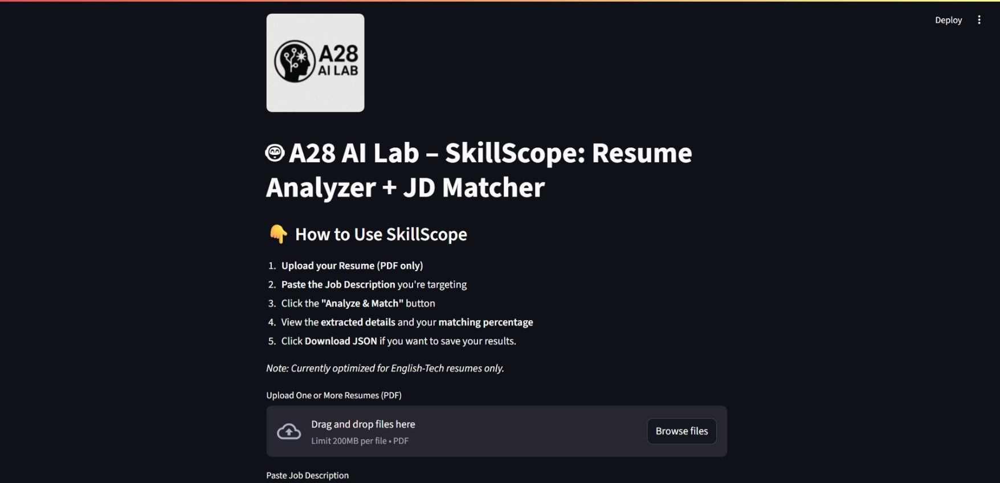

# 📄 SkillScope - Resume Analyzer & JD Matcher

SkillScope is an AI-powered resume parser and job description matcher. Built with Python and Streamlit, it extracts structured data from resumes and compares them against job descriptions to identify skill match, gaps, and fit percentage.

> 👨‍💻 Built and maintained by [A28 AI Lab](https://github.com/a28-ai-lab)

---

## 🚀 Features

- 🧠 Smart skill extraction using NLP and fuzzy matching
- 📄 Resume parsing with OCR fallback (Tesseract)
- 📋 JD comparison and skill match percentage
- 📊 Candidate ranking for multiple resumes
- 🧾 Structured JSON export per resume
- 📥 Simple UI using Streamlit

---

## Demo Screenshot


---

## 🚀 Live Demo

[Streamlit App](https://share.streamlit.io/your-streamlit-url-here)  
(Replace with actual deployed link once live)

---

## 🛠 Tech Stack

- Python
- spaCy (for NLP)
- pandas
- rapidfuzz (for fuzzy matching)
- PyMuPDF (resume PDF parsing)
- PyTesseract (OCR Fallback)
- Pillow
- Fitz
- Streamlit (UI)

---
 
## 📂 Project Structure

skillscope 
│

├── app.py                  # Streamlit app main file

├── resume_parser.py        # Core logic for extracting and comparing resume data

├── requirements.txt        # List of Python dependencies

├── skills.csv              # Master list of skills used for matching

├── sample_resume9.pdf      # Sample resume file (for testing/demo)

├── parsed_resume.json      # Output JSON from parsed resume

├── README.md               # Project documentation

---

## 🔧 Installation

```bash
git clone https://github.com/a28-ai-lab/skillscope
cd skillscope
pip install -r requirements.txt
streamlit run app.py
```

---
## ⚙️ Setup Instructions

1. Clone the repo:
2.  Install Dependencies
3. git clone https://github.com/yourusername/skillscope.git cd skillscope

2. Install dependencies:
```
pip install -r requirements.txt
```

3. (Optional) If using Windows, update Tesseract path:
```
pytesseract.pytesseract.tesseract_cmd = r"C:\Program Files\Tesseract-OCR\tesseract.exe"
```
4. Run the app:

```
streamlit run app.py
```

5. Visit http://localhost:8501 in your browser


---

## 👤 Author

Ashish S. — Founder, A28 AI Lab - Registered Under Govt. Of India
Reach me on LinkedIn or GitHub
[LinkedIn](linkedin.com/in/ashish-sa-kumar) | [GitHub](github.com/ashishkumar-data)


---

## 🧠 License

This project is proprietary and closed-source.
All rights reserved © 2025 [A28 AI Lab].
Unauthorized copying or distribution of the source code is strictly prohibited.


---

## 🛠  Future Enhancements

- 🔍 Named Entity skill classification (e.g., core vs soft skills)
- 📤 Export to Excel
- 🧠 Resume suggestions based on JD
- 🌐 Hosted version on Streamlit Cloud

---